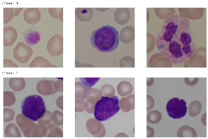

# [Grapevine Leaves Classification](https://github.com/nargesbh/Grapevine-Leaves-Classification/tree/main)

**Project Date**: July 2022\
*Data mining final project*
## Description
 The primary objective is to classify grapevine leaves into five distinct classes. Here I implemented multiple deep machine learning models using a transfer learning approach based on pre-trained convolutional neural networks including MobileNetV2, ResNet50, EfficientNetB3, and InceptionNetV3. The project also explores the impact of autoencoders on classification accuracy and employs 10-fold cross-validation as a performance metric.
## Libraries Used
tensorflow, keras, PIL, pandas, numpy, scikit-learn

---
## [Histopathology Image Classification](https://github.com/nargesbh/Histopathology-Image-Classification/tree/main)

**Project Date**: May 2023\
*Image Processing project*
## Description
In this project, I explored various deep learning models for image classification, specifically in the context of histopathology image analysis. I trained and evaluated these models on a custom dataset and compared the performance of different model architectures. The models include the homework model, an updated model with modified convolutional layers, A pre-trained ResNet-50 model fine-tuned for our classification task.

## Libraries Used
tensorflow, keras, OpenCV, PIL, pandas, numpy, scikit-learn, Seaborn, Matplotlib

