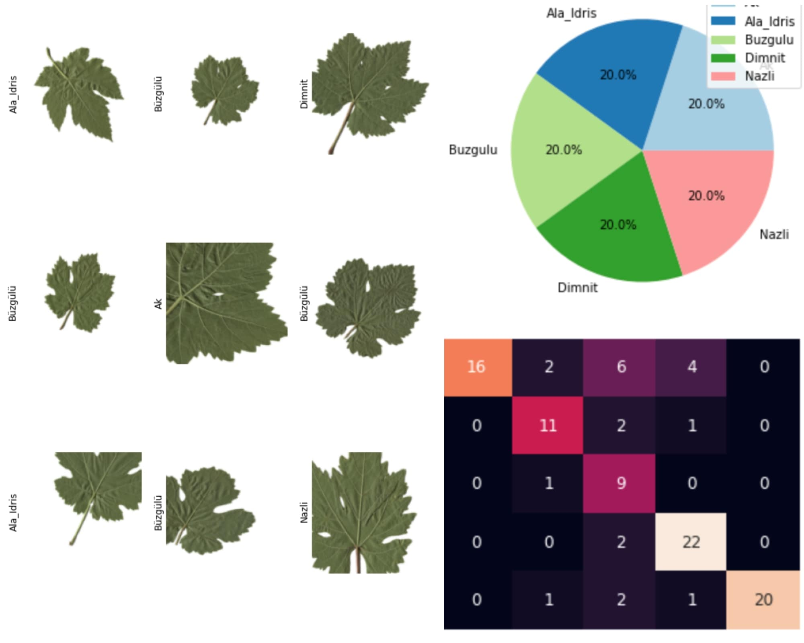

# Grapevine-Leaves-Classification

**Project Date**: July 2022

## Description
This project is the final assignment for a data mining course. The primary objective is to classify grapevine leaves into five distinct classes using various deep learning models, including MobileNetV2, ResNet50, EfficientNetB3, and InceptionNetV3. The project also explores the impact of autoencoders on classification accuracy and employs 10-fold cross-validation as a performance metric.

The repository contains the project's source code and resources, with a specific focus on the classification of grapevine leaves. The overarching goal is to develop a machine learning model capable of accurately identifying different grapevine leaf types. This model has potential applications in viticulture and plant research.

## Libraries Used
tensorflow, keras, PIL, pandas, numpy, sklearn

## GitHub Repository
Find the project's source code and resources on [GitHub](https://github.com/nargesbh/Grapevine-Leaves-Classification).
om/nargesbh/Grapevine-Leaves-Classification/tree/main).

